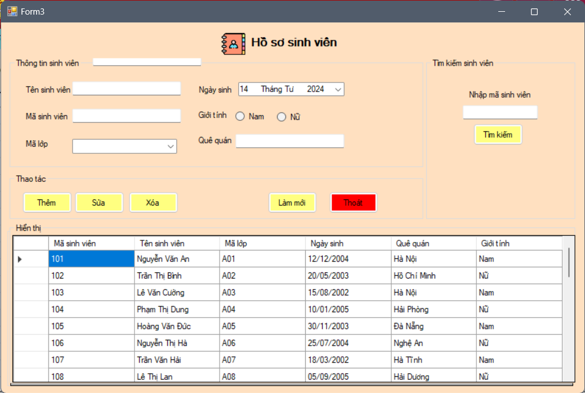

# Bài tập lớn môn Phân tích thiết kế hệ thống thông tin

## Đề tài
- Tên đề tài: Hệ thống quản lý sinh viên
- Báo cáo cuối kỳ và tài liệu liên quan: [Link](https://drive.google.com/drive/folders/1dTjtBEfGEJeXr4PoeIMJpjeUoDU7dvOR?usp=drive_link)
---

## Demo giao diện
- Form đăng nhập


- Form đăng ký tài khoản


- Form hồ sơ sinh viên


## Quick start
- Vào search -> Gõ cmd
- Copy dòng này vào cmd
  
```
git clone https://github.com/qnhat2004/Project_Analyzing_and_Designing_Information_System.git
```

- Mở file `Project_Analyzing_and_Designing_Information_System\main\form_trangchinh\main.sln`
- Mở file `sv.sql` và `account.sql` lên, chạy 2 dòng đầu của 2 file đó gồm `create database` và `use database`
- Sửa tên server của mình (SUNSHINE) thành tên server của máy bạn
